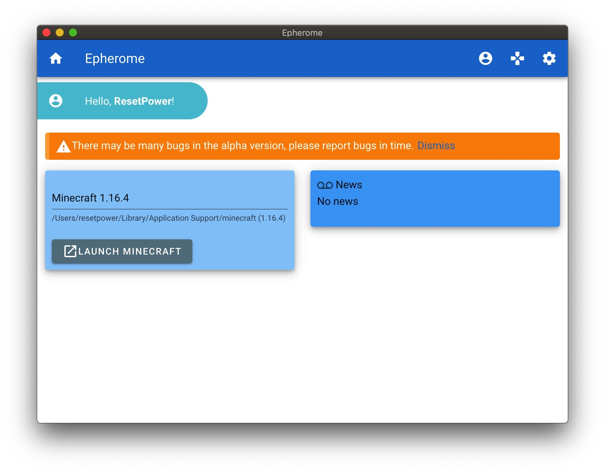

# Epherome

[简体中文](README_zh_cn.md)

  

  <h3 align="center">Epherome: Simple Minecraft Launcher</h3>
  

    Use Electron framework to write, support cross-platform and multi-language
     
    <a href="https://github.com/ResetPower/Epherome/releases">Downloads</a>
    ·
    <a href="https://github.com/ResetPower/Epherome/issues">Report Bug</a>
  

## Introduction

Epherome is a Minecraft launcher written in Electron that supports simple launch functions

## Screenshot

## Development Environment

Electron: 11.2.3
Chrome: 87.0.4280.141
Node.js: 12.18.3
V8: 8.7.220.31-electron.0

## LICENSE

[GNU General Public License 3.0](https://github.com/ResetPower/Epherome/blob/master/LICENSE)

