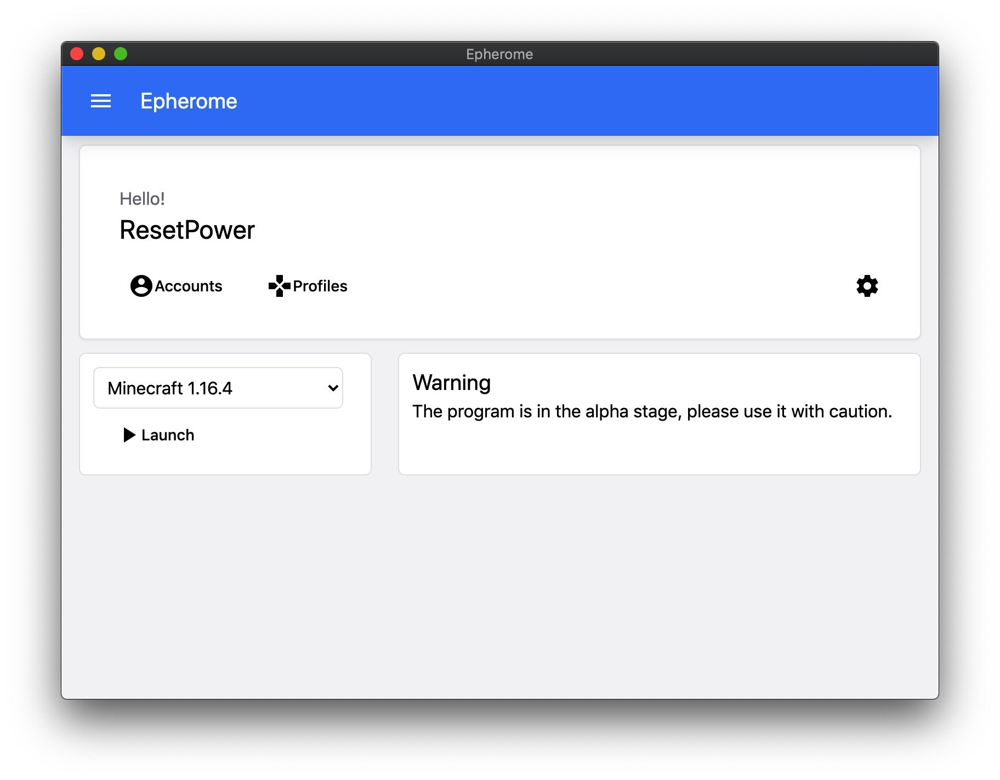

# Epherome

Simple Minecraft launcher

[简体中文](docs/README_zh_cn.md)

## Introduction

Epherome is a simple Minecraft launcher developed by Electron and React

## Screenshots

## LICENSE

[GNU General Public License 3.0](LICENSE)

