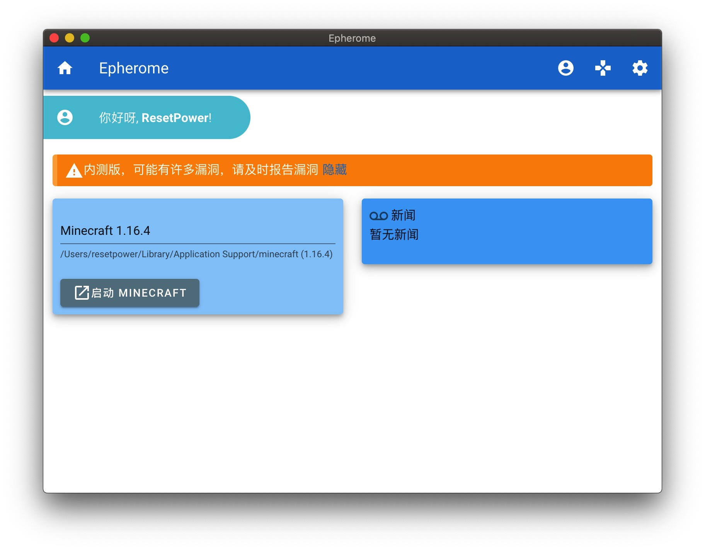

# Epherome

[English](README.md)

  

  <h3 align="center">Epherome: 简单的Minecraft启动器</h3>
  

    使用 Electron 框架编写，支持跨平台与多语言
     
    <a href="https://github.com/ResetPower/Epherome/releases">下载</a>
    ·
    <a href="https://github.com/ResetPower/Epherome/issues">报告 Bug</a>
  

## 简介

Epherome 是一个用 Electron 编写的，支持简单启动功能的 Minecraft 启动器

## 截图

## 开发环境

Electron: 11.2.3
Chrome: 87.0.4280.141
Node.js: 12.18.3
V8: 8.7.220.31-electron.0

## 协议

[GNU General Public License 3.0](LICENSE)
